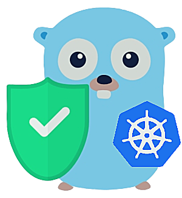

# k8s-authz
[](https://github.com/casbin/k8s-authz/issues)
[](https://gitter.im/casbin/lobby)
[](https://opensource.org/licenses/Apache-2.0)

<p align="center">
    
</p>
   
K8s-authz is authorization middleware for [Kubernetes](https://github.com/kubernetes/kubernetes), which is based on [Casbin](https://github.com/casbin/casbin). 

## Installation

```
go get github.com/casbin/k8s-authz
```
## Working

This middleware uses K8s validation admission webhook to check the policies defined by casbin, for every request related to the pods. The K8s API server needs to know when to send the incoming request to our admission controller. For this part, we have defined a validation webhook which would proxy the requests for the pods and perform policy verification on it. The user would be allowed to perform the operations on the pods, only if the casbin enforcer authorizes it. The enforcer checks the roles of the user defined in the policies. This middleware would be deployed on the k8s cluster. 

## Requirements
Before proceeding, make sure to have the following-
- Running k8s Cluster
- kubectl
- Openssl

## Configuration and Usage
 
- Generate the certificates and keys for every user by using openssl and running the following script:-
```
./gen_cert.sh
```
- Build the docker image from the [Dockerfile](https://github.com/casbin/k8s-authz/blob/master/Dockerfile) manually by running the following command and then change the build version here and at the deployment [file](https://github.com/casbin/k8s-authz/blob/718f58c46e3dbf79063b5b1c18348c2fee5de9e9/manifests/deployment.yaml#L18), as per the builds. 
```
 docker build -t casbin/k8s_authz:0.1 .
```
- Define the casbin policies in the [model.conf](https://github.com/casbin/k8s-authz/blob/master/config/model.conf) and [policy.csv](https://github.com/casbin/k8s-authz/blob/master/config/policy.csv). You can refer the [docs](https://casbin.org/docs/en/how-it-works) to get to know more about the working of these policies.

- Before deploying, you can change the ports in [main.go](https://github.com/casbin/k8s-authz/blob/master/main.go) and also in the validation webhook configuration [file](https://github.com/casbin/k8s-authz/blob/master/manifests/deployment.yaml) depending on your usage.
- Deploy the validation controller and the webhook on k8s cluster by running:-
```
kubectl apply -f deployment.yaml
```
Now the server should be running and ready to validate the requests for the operations on the pods. 

## Documentation

https://casbin.org/docs/en/middlewares 

## Community

In case of any query, you can ask on our gitter [channel](https://gitter.im/casbin/lobby).

